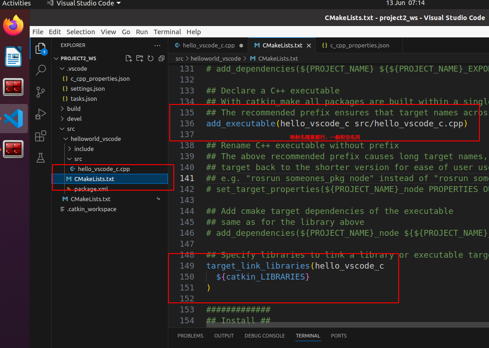

## ROS概述与环境搭建

#### ROS快速体验

###### 1、创建工作空间并初始化

```
mkdir -p 自定义空间名称/src
cd 自定义空间名称
catkin_make
```

```shell
zayden@ubuntu:~$ ls
Desktop  Documents  Downloads  Music  Pictures  Public  snap  Templates  Videos
zayden@ubuntu:~$ mkdir -p demo/src
zayden@ubuntu:~$ ls
demo     Documents  Music     Public  Templates
Desktop  Downloads  Pictures  snap    Videos
zayden@ubuntu:~$ cd demo/
zayden@ubuntu:~/demo$ catkin_make
Base path: /home/zayden/demo
Source space: /home/zayden/demo/src
Build space: /home/zayden/demo/build
Devel space: /home/zayden/demo/devel
Install space: /home/zayden/demo/install
Creating symlink "/home/zayden/demo/src/CMakeLists.txt" pointing to "/opt/ros/noetic/share/catkin/cmake/toplevel.cmake"
####
#### Running command: "cmake /home/zayden/demo/src -DCATKIN_DEVEL_PREFIX=/home/zayden/demo/devel -DCMAKE_INSTALL_PREFIX=/home/zayden/demo/install -G Unix Makefiles" in "/home/zayden/demo/build"
####
-- The C compiler identification is GNU 9.4.0
-- The CXX compiler identification is GNU 9.4.0
-- Check for working C compiler: /usr/bin/cc
-- Check for working C compiler: /usr/bin/cc -- works
-- Detecting C compiler ABI info
-- Detecting C compiler ABI info - done
-- Detecting C compile features
-- Detecting C compile features - done
-- Check for working CXX compiler: /usr/bin/c++
-- Check for working CXX compiler: /usr/bin/c++ -- works
-- Detecting CXX compiler ABI info
-- Detecting CXX compiler ABI info - done
-- Detecting CXX compile features
-- Detecting CXX compile features - done
-- Using CATKIN_DEVEL_PREFIX: /home/zayden/demo/devel
-- Using CMAKE_PREFIX_PATH: /opt/ros/noetic
-- This workspace overlays: /opt/ros/noetic
-- Found PythonInterp: /usr/bin/python3 (found suitable version "3.8.10", minimum required is "3") 
-- Using PYTHON_EXECUTABLE: /usr/bin/python3
-- Using Debian Python package layout
-- Found PY_em: /usr/lib/python3/dist-packages/em.py  
-- Using empy: /usr/lib/python3/dist-packages/em.py
-- Using CATKIN_ENABLE_TESTING: ON
-- Call enable_testing()
-- Using CATKIN_TEST_RESULTS_DIR: /home/zayden/demo/build/test_results
-- Forcing gtest/gmock from source, though one was otherwise available.
-- Found gtest sources under '/usr/src/googletest': gtests will be built
-- Found gmock sources under '/usr/src/googletest': gmock will be built
-- Found PythonInterp: /usr/bin/python3 (found version "3.8.10") 
-- Found Threads: TRUE  
-- Using Python nosetests: /usr/bin/nosetests3
-- catkin 0.8.10
-- BUILD_SHARED_LIBS is on
-- BUILD_SHARED_LIBS is on
-- Configuring done
-- Generating done
-- Build files have been written to: /home/zayden/demo/build
####
#### Running command: "make -j4 -l4" in "/home/zayden/demo/build"
####
zayden@ubuntu:~/demo$ ls
build  devel  src
```

上述命令首先会创建一个工作空间及`src`子目录，然后进入工作空间调用`catkin_make`命令编译


###### 2、进入src创建ros包并添加依赖

```
cd src
catkin_create_pkg 自定义ROS包名 roscpp rospy std_msgs
```


上述命令会在工作空间下生成一个功能包，该功能包依赖于`roscpp`、`rospy`、`std_msgs`，其中：

- `roscpp`是使用`C++`实现的库，旨在成为`ROS`的高性能库
- `rospy`是使用`Python`实现的库，一般用于对性能无要求的场景，旨在提高开发效率
- `std_msgs`是标准信息库


###### 3、使用C++编写hello world程序

> 进入ros功能包的src目录编辑源文件

```shell
zayden@ubuntu:~/demo/src$ ls
CMakeLists.txt  helloworld
zayden@ubuntu:~/demo/src$ cd helloworld/
zayden@ubuntu:~/demo/src/helloworld$ ls
CMakeLists.txt  include  package.xml  src
zayden@ubuntu:~/demo/src/helloworld$ touch helloworld_c.cpp
zayden@ubuntu:~/demo/src/helloworld$ ls
CMakeLists.txt  helloworld_c.cpp  include  package.xml  src
zayden@ubuntu:~/demo/src/helloworld$ mv helloworld_c.cpp src
zayden@ubuntu:~/demo/src/helloworld$ gedit src/helloworld_c.cpp
```

编写`demo/src/helloworld/src/helloworld_c.cpp`文件：

```c++
# include "ros/ros.h"

int main(int argc, char *argv[]){
    // 执行ros节点初始化
    ros::init(argc, argv, "hello_node");
    // 控制台输出hello world
    ROS_INFO("hello world!");
    return 0;
}
```

> 编辑ros包下的Cmakelist.txt文件

```
在功能包helloworld的子目录的同级目录下找到Cmakelist.txt文件，使用：
gedit Cmakelist.txt 
1、在第136行取消注释后修改
修改前：# add_executable(${PROJECT_NAME}_node src/helloworld_node.cpp)
修改后：add_executable(hello src/helloworld_c.cpp)

2、在第149~151行取消注释后修改
修改前：
    # target_link_libraries(${PROJECT_NAME}_node
    #   ${catkin_LIBRARIES}
    # )
修改后：
	target_link_libraries(hello
      ${catkin_LIBRARIES}
    )
```

> 进入工作空间目录并编译

```shell
zayden@ubuntu:~/demo/src/helloworld$ cd ../../
zayden@ubuntu:~/demo$ ls
build  devel  src
zayden@ubuntu:~/demo$ catkin_make
Base path: /home/zayden/demo
Source space: /home/zayden/demo/src
Build space: /home/zayden/demo/build
Devel space: /home/zayden/demo/devel
Install space: /home/zayden/demo/install
####
#### Running command: "cmake /home/zayden/demo/src -DCATKIN_DEVEL_PREFIX=/home/zayden/demo/devel -DCMAKE_INSTALL_PREFIX=/home/zayden/demo/install -G Unix Makefiles" in "/home/zayden/demo/build"
####
-- Using CATKIN_DEVEL_PREFIX: /home/zayden/demo/devel
-- Using CMAKE_PREFIX_PATH: /opt/ros/noetic
-- This workspace overlays: /opt/ros/noetic
-- Found PythonInterp: /usr/bin/python3 (found suitable version "3.8.10", minimum required is "3") 
-- Using PYTHON_EXECUTABLE: /usr/bin/python3
-- Using Debian Python package layout
-- Using empy: /usr/lib/python3/dist-packages/em.py
-- Using CATKIN_ENABLE_TESTING: ON
-- Call enable_testing()
-- Using CATKIN_TEST_RESULTS_DIR: /home/zayden/demo/build/test_results
-- Forcing gtest/gmock from source, though one was otherwise available.
-- Found gtest sources under '/usr/src/googletest': gtests will be built
-- Found gmock sources under '/usr/src/googletest': gmock will be built
-- Found PythonInterp: /usr/bin/python3 (found version "3.8.10") 
-- Using Python nosetests: /usr/bin/nosetests3
-- catkin 0.8.10
-- BUILD_SHARED_LIBS is on
-- BUILD_SHARED_LIBS is on
-- ~~~~~~~~~~~~~~~~~~~~~~~~~~~~~~~~~~~~~~~~~~~~~~~~~
-- ~~  traversing 1 packages in topological order:
-- ~~  - helloworld
-- ~~~~~~~~~~~~~~~~~~~~~~~~~~~~~~~~~~~~~~~~~~~~~~~~~
-- +++ processing catkin package: 'helloworld'
-- ==> add_subdirectory(helloworld)
-- Configuring done
-- Generating done
-- Build files have been written to: /home/zayden/demo/build
####
#### Running command: "make -j4 -l4" in "/home/zayden/demo/build"
####
Scanning dependencies of target hello
[ 50%] Building CXX object helloworld/CMakeFiles/hello.dir/src/helloworld_c.cpp.o
[100%] Linking CXX executable /home/zayden/demo/devel/lib/helloworld/hello
[100%] Built target hello
zayden@ubuntu:~/demo$ 
```

会生成`build devel`

> 执行

使用`Ctrl + Alt + T`打开新的终端窗口，在里面输入`roscore`

再启动命令行2

```sh
zayden@ubuntu:~/demo$ source ./devel/setup.bash 
zayden@ubuntu:~/demo$ rosrun helloworld hello
[ INFO] [1718152728.853441295]: hello world!
zayden@ubuntu:~/demo$ 
```

其中`helloworld`是功能包名，`hello`是`C++`节点名


###### 4、使用Python编写helloworld程序

```shell
cd helloworld
mkdir scripts

touch test.py
gedit test.py
```

接着在打开的`test.py`文件中编写`Python`源码：

```python
#! /usr/bin/env python

import rospy


if __name__ == "__main__":
    rospy.init_node("Hello")
    rospy.loginfo("Hello World!!!")
```

然后为`Python`文件添加可执行权限

```shell
chomd +x test.py
```

接着编辑`ros`包下的`CMakeLists.txt`文件，大概在第162行，修改后代码如下：

```
catkin_install_python(PROGRAMS
  scripts/test.py
  DESTINATION ${CATKIN_PACKAGE_BIN_DESTINATION}
)
```

最后进入工作空间目录执行

```shell
cd ~/demo
catkin_make
```

接着`Ctrl + Alt + T`启动命令行1，输入`roscore`

然后打开命令行2，输入下面命令：

```shell
cd ~/demo
source ./devel/setup.bash
# rosrun 包名 自定义文件名.py
rosrun helloworld test.py
```


#### VSCode相关配置

###### 1、创建ROS工作空间

```shell
mkdir -p project2_ws/src
cd project2_ws
catkin_make
```

其中`src`是必须要有的


###### 2、启动VSCode

进入`project2_ws`后启动`vscode`

```shell
cd project2_ws
code .
```


###### 3、VSCode中编译ROS

使用快捷键`Ctrl + Shift +B`调用编译，选择`catkin_make:build`

点击图中显示的`⚙`图标，配置设置为默认，修改`.vscode/tasks.json`文件


```json
{
	"version": "2.0.0",
	"tasks": [
		{
			"type": "catkin_make",
			"args": [
				"--directory",
				"/home/zayden/Desktop/project2_ws",
				"-DCMAKE_BUILD_TYPE=RelWithDebInfo"
			],
			"problemMatcher": [
				"$catkin-gcc"
			],
			"group": "build",
			"label": "catkin_make: build"
		}
	]
}
```


###### 4、创建ROS功能包


输入功能包的名字，按回车键确认


安装依赖，在里面输入`rospy roscpp std_msgs`


###### 5、C++实现

经过上述步骤后的目录结构如下


在内层`src`目录下新建`cpp`文件，内部写入代码：

```c++
# include "ros/ros.h"

using namespace std;

int main(int argc, char *argv[]){
    setlocale(LC_ALL, "");
    ros::init(argc, argv, "hello");
    ROS_INFO("hhhh笑死鼠");
    return 0;
}
```

若编写代码发现没有代码提示，可以修改`.vscode/c_cpp_properties.json`

```json
"cStandard": "gnu17",
"cppStandard": "c++17"
```

`main`函数的参数不可以被`const`修饰，在`ROS_INFO`终端输出有中文时，会出现乱码，在函数开头加上`setlocale(LC_ALL, "")`



接着可以在一个终端中`roscore`，另一个终端

```shell
source ./devel/setup.bash
rosrun helloworld_vscode hello_vscode_c
```


###### 6、Python实现

流程基本和`C++`实现类似，在功能包`helloworld_vscode`下面创建文件夹`scripts`，接着在文件夹下面新建`hello_vscode_p.py`文件，里面编写代码：

```python
#! /usr/bin/env python
"""
    Python 版本的 HelloVScode，执行在控制台输出 HelloVScode
    实现:
    1.导包
    2.初始化 ROS 节点
    3.日志输出 HelloWorld
"""

import rospy # 1.导包

if __name__ == "__main__":

    rospy.init_node("Hello_Vscode_p")  # 2.初始化 ROS 节点
    rospy.loginfo("Hello VScode, 我是 Python ....")  #3.日志输出 HelloWorld
```

选择在终端打开`scripts`文件夹，修改文件权限`chmod +x hello_vscode_p.py`


先编译，然后切换到工作空间下面启动`roscore`，用另一个终端输入：

```
source ./devel/setup.bash
rosrun helloworld_vscode hello_vscode_p.py
```


用软链接将`/usr/bin/python`链接到`/usr/bin/python3`下面

