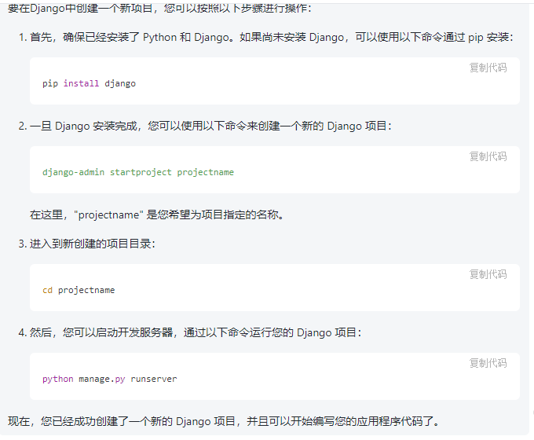
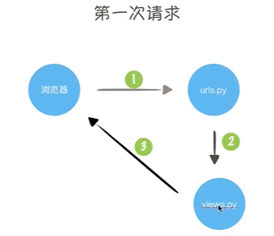
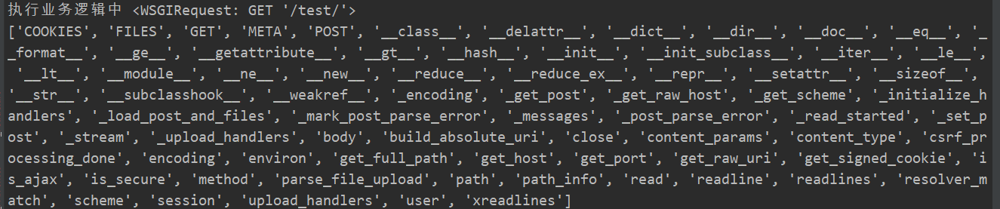
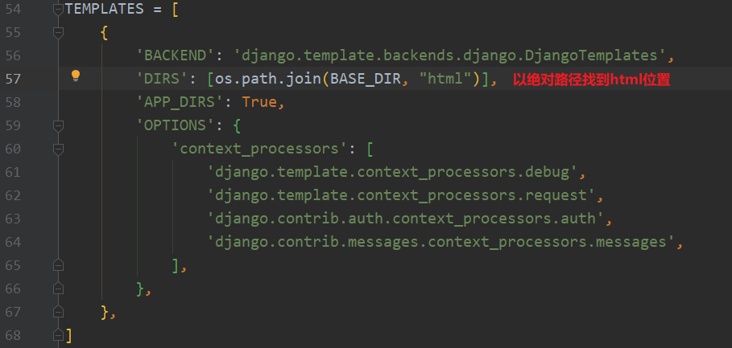
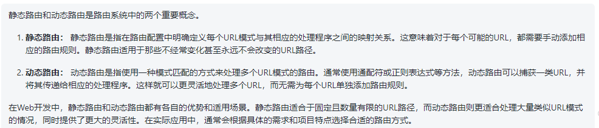
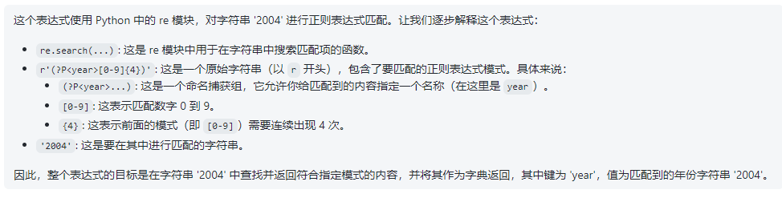
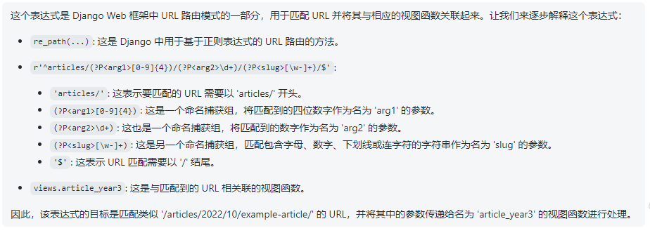
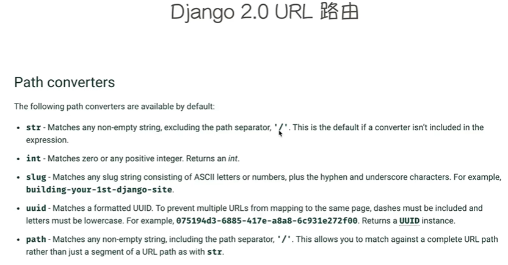
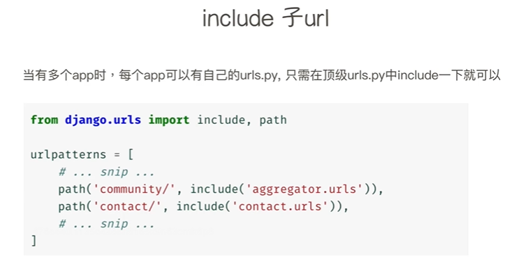
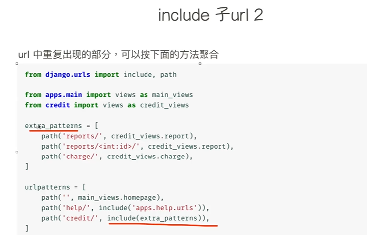

#### 用Socket实现一个web服务器

```python
import socket


def main():
    # AF_INET表IPV4、SOCK_STREAM表TCP/IP
    sock = socket.socket(socket.AF_INET, socket.SOCK_STREAM)
    # 强制关闭端口占用，不用此语句需要等待30s
    sock.setsockopt(socket.SOL_SOCKET, socket.SO_REUSEADDR, 1)
    sock.bind(('localhost', 8000))
    # 最多有5个请求
    sock.listen(5)

    while True:
        # 等待浏览器访问
        conn, addr = sock.accept()
        # 接收浏览器发送来的请求内容，1024个字符
        data = conn.recv(1024)
        print(data)

        # 给浏览器返回内容
        conn.send(b"HTTP/1.1 200 OK\r\nContent-Type:text/html; charset=utf-8\r\n\r\n")
        conn.send("<h1 style='color:red'>电脑前的你长的真好看！</h1>".encode("utf-8"))

        # 关闭浏览器创建的socket连接
        conn.close()


if __name__ == "__main__":
    main()
```


#### 用wsgiref实现一个web服务器

```python
from wsgiref.simple_server import make_server


def run_server(environ, start_response):
    """
    当有用户在浏览器上访问: localhost:8000，立即执行该函数并将函数返回值返回给客户浏览器
    :param environ: 请求相关内容，比如浏览器类型、版本、来源地址、url等
    :param start_response: 响应相关
    :return:
    """
    start_response('200 OK', [('Content-Type', 'text/html;charset=utf-8')])
    print(environ)
    return [bytes('<h1>测试', encoding='utf-8'), ]


if __name__ == "__main__":
    httpd = make_server('localhost', 8000, run_server)
    # serve_forever()相当于死循环
    httpd.serve_forever()
```


#### 用wsgiref实现支持多url的web服务器

```python
from wsgiref.simple_server import make_server


def book(environ, start_response):
    print("book page!")
    start_response("200 OK", [('Content-Type', 'text/html;charset=utf-8')])
    return [bytes('<h2>book page!</h2>', encoding='utf-8'), ]


def cloth(environ, start_response):
    print("cloth page!")
    start_response("200 OK", [('Content-Type', 'text/html;charset=utf-8')])
    return [bytes('<h2 style="color:red">cloth page!</h2>', encoding='utf-8'), ]


def routers():
    """负责把url与对应的方法关联起来"""
    urlpatterns = {
        '/book': book,
        '/cloth': cloth,
    }

    return urlpatterns


def run_server(environ, start_response):
    """
    当有用户在浏览器上访问localhost:8001，立即执行该函数并将函数返回值返回给用户浏览器
    :param environ: 请求相关内容，比如浏览器类型、版本、来源地址、url等
    :param start_response: 响应相关
    :return:
    """
    # 拿到所有的url
    urlpatterns = routers()
    url = environ.get("PATH_INFO")
    print("request url", url)

    if url in urlpatterns:
        func_data = urlpatterns[url](environ, start_response)
        # 真正返回数据给用户
        return func_data
    else:
        # 注意404后面不写Not Found会报错
        start_response("404 Not Found", [('Content-Type', 'text/html;charset=utf-8')])
        return [bytes('<h1 style="font-size:50px">404, Page not found!</h1>', encoding="utf-8"), ]


if __name__ == "__main__":
    s = make_server('localhost', 8001, run_server)
    s.serve_forever()
```


#### 用wsgiref实现支持图片显示的web服务器

```python
from wsgiref.simple_server import make_server
import re
import os

BASE_DIR = os.path.dirname(os.path.abspath(__file__))


def book(environ, start_response):
    print("book page!")
    start_response("200 OK", [('Content-Type', 'text/html;charset=utf-8')])
    data = """
        <h1>欢迎来到</h1>
            
        <p>学习使我快乐</p>
    """
    return [bytes(data, encoding='utf-8'), ]


def cloth(environ, start_response):
    print("cloth page!")
    start_response("200 OK", [('Content-Type', 'text/html;charset=utf-8')])
    return [bytes('<h2 style="color:red">cloth page!</h2>', encoding='utf-8'), ]


def img_handler(url):
    """
    :param url: /static/imgs/test.png
    :return:
    """
    img_path = re.sub('/static', '/static_data', url)
    img_abs_path = "%s%s" % (BASE_DIR, img_path)
    img_abs_path = img_abs_path.replace("\\", "/")
    print("------------------{}--------------".format(img_abs_path))
    if os.path.isfile(img_abs_path):
        f = open(img_abs_path, "rb")
        # 获取图片文件内容
        data = f.read()
        # 0代表图片能找到，1代表找不到
        return [data, 0]
    return [None, 1]


def routers():
    """负责把url与对应的方法关联起来"""
    urlpatterns = {
        '/book': book,
        '/cloth': cloth,
    }

    return urlpatterns


def run_server(environ, start_response):
    """
    当有用户在浏览器上访问localhost:8001，立即执行该函数并将函数返回值返回给用户浏览器
    :param environ: 请求相关内容，比如浏览器类型、版本、来源地址、url等
    :param start_response: 响应相关
    :return:
    """
    # 拿到所有的url
    urlpatterns = routers()
    url = environ.get("PATH_INFO")
    print("request url", url)

    if url in urlpatterns:
        func_data = urlpatterns[url](environ, start_response)
        # 真正返回数据给用户
        return func_data
    elif url.startswith("/static/"):
        img_data, img_status = img_handler(url)
        if not img_status:
            start_response("200 OK", [('Content-Type', 'text/jpeg;charset=utf-8')])
            return [img_data, ]
    else:
        # 注意404后面不写Not Found会报错
        start_response("404 Not Found", [('Content-Type', 'text/html;charset=utf-8')])
        return [bytes('<h1 style="font-size:50px">404, Page not found!</h1>', encoding="utf-8"), ]


if __name__ == "__main__":
    s = make_server('localhost', 8001, run_server)
    s.serve_forever()
```


#### 安装和创建Django项目
<div style="text-align:center">
    
</div>


```python
# 在创建Django项目时，应该使用命令行而不是Python交互式解释器。
│  manage.py	# 管理程序的文件，启动和结束等
│
└─my_site
        settings.py	# 程序的配置文件
        urls.py		# 程序的路由系统，即url和处理其函数的对应的关系
        wsgi.py		# 指定框架的wsgi---基于wsgi规范开发
        __init__.py
# 只需要修改settings.py和urls.py
```


#### 创建app

在第二层`my_site`同级目录下`django-admin startapp app01`创建`app01`

```shell
│  db.sqlite3
│  manage.py
│
├─app01
│  │  admin.py		# 数据库后台
│  │  apps.py		# django把项目和app关联起来的一个文件
│  │  models.py		# 数据库操作地方
│  │  tests.py		# django自带的一些单元测试
│  │  views.py		# 业务逻辑代码(写python函数)
│  │  __init__.py	# 代表python的包
│  │
│  └─migrations		# 数据库相关
│          __init__.py
│
└─my_site
    │  settings.py
    │  urls.py
    │  wsgi.py
    │  __init__.py
    │
    └─__pycache__
            settings.cpython-37.pyc
            urls.cpython-37.pyc
            wsgi.cpython-37.pyc
            __init__.cpython-37.pyc
```


#### 完成第一次django请求

```
1. 匹配路由，路由分发器查找用户请求的url对应关系
	1. 找到了业务函数，就调用
	2. 找不到就报404
2. 业务函数，执行业务逻辑
3. 返回数据给浏览器
```



先在`my_site/urls.py`里面

```python
from django.contrib import admin
from django.urls import path
from app01 import views		# 导入app01里面的views.py业务模块

urlpatterns = [
    path('admin/', admin.site.urls),
    path('test/', views.test_view),		# 确定路由映射关系
]
```

然后在`app01/views.py`里面

```python
from django.shortcuts import render, HttpResponse


def test_view(request):
    print("执行业务逻辑中", request)
    print(dir(request))
    # HttpResponse ~ start_response("200 OK", [('Content-Type', 'text/jpeg;charset=utf-8')])
    return HttpResponse("<h1 style='color:red'>好好学习</h1>")
```

启动服务器`python manage.py runserver localhost:8000`

会显示`404`，是`django`自己封装好的，我们应访问`localhost:8000/test`



总结一下：

```python
1. urls.py编写路由
2. 在views.py写一个业务函数
	2.1 编写业务代码
    2.2 同HttpResponse 方法返回数据给前端
3. python manage.py runserver localhost:8000/test
```


#### 开发一个登录表单

在`my_site/urls.py`下面

```python
from django.contrib import admin
from django.urls import path
from app01 import views

urlpatterns = [
    path('admin/', admin.site.urls),
    path('test/', views.test_view),
    path('login/', views.login_view),
]
```

在`app01/views.py`下面：

```python
from django.shortcuts import render, HttpResponse


def test_view(request):
    print("执行业务逻辑中", request)
    print(dir(request))
    # HttpResponse ~ start_response("200 OK", [('Content-Type', 'text/jpeg;charset=utf-8')])
    return HttpResponse("<h1 style='color:red'>好好学习</h1>")


def login_view(request):
    html = """
        <!DOCTYPE html>
        <html lang="en">
        <head>
            <meta charset="UTF-8">
            <title>笑鼠登录页面</title>
        </head>
        <body>
            <form method="post">
                <input type="text" name="账户：">
                <input type="password" name="密码：">
                <input type="submit" value="登录"> 
            </form>
        </body>
        </html>
    """

    return HttpResponse(html)
```

浏览器`localhost:8000/login`

在`html`内容过多时，需要单独放到新文件中，在使用`python`去调用


#### 模板初探

在`app01`同级目录下新建目录`html`，里面新建文件`form.html`写入`html`相关信息

```html
<!DOCTYPE html>
<html lang="en">
<head>
    <meta charset="UTF-8">
    <title>笑鼠登录页面</title>
</head>
<body>
    <form method="post">
        <input type="text" name="账户：">
        <input type="password" name="密码：">
        <input type="checkbox" value="remember me">
        <input type="submit" value="登录">
    </form>
</body>
</html>
```

但是由于不是`django`创建的，所以`django`无法查找，需要在`my_site/settings.py`里面修改`TEMPLATES`



在`app01/views.py`中修改：

```python
from django.shortcuts import render, HttpResponse


def test_view(request):
    print("执行业务逻辑中", request)
    print(dir(request))
    # HttpResponse ~ start_response("200 OK", [('Content-Type', 'text/jpeg;charset=utf-8')])
    return HttpResponse("<h1 style='color:red'>好好学习</h1>")


def login_view(request):
    return render(request, "form.html")
```


#### MVC&MTV架构


```
MVC VIEWS 负责业务逻辑处理+数据展示
MTV Views 业务逻辑处理
	Templates 数据展示
```


#### 路由系统介绍




#### 路由匹配规则

`Django`的路由本质是通过正则表达式来对用户请求的`url`进行匹配

```python
s = re.search(r'(?P<year>[0-9]{4})', '2004').groupdict()
```



先在`urls.py`里面修改：

```python
"""my_site URL Configuration

The `urlpatterns` list routes URLs to views. For more information please see:
    https://docs.djangoproject.com/en/2.0/topics/http/urls/
Examples:
Function views
    1. Add an import:  from my_app import views
    2. Add a URL to urlpatterns:  path('', views.home, name='home')
Class-based views
    1. Add an import:  from other_app.views import Home
    2. Add a URL to urlpatterns:  path('', Home.as_view(), name='home')
Including another URLconf
    1. Import the include() function: from django.urls import include, path
    2. Add a URL to urlpatterns:  path('blog/', include('blog.urls'))
"""
from django.contrib import admin
from django.urls import path, re_path
from app01 import views

urlpatterns = [
    path('admin/', admin.site.urls),
    path('test/', views.test_view),
    path('login/', views.login_view),
    # $表以这整个字符串结尾, ^表以这个字符串开头
    re_path(r'^articles/2003/$', views.article_2003),
    # 写死了year，要传参到views里面
    # re_path(r'^articles/(?P<year>[0-9]{4})/$', views.article_year),
    # 没写死参数
    # re_path(r'^articles/([0-9]{4})/$', views.article_year2),
    re_path(r'^articles/(?P<arg1>[0-9]{4})/(?P<arg2>\d+)/(?P<slug>[\w-]+)/$', views.article_year3),
]
```

接着在`views.py`里面修改：

```python
from django.shortcuts import render, HttpResponse


def test_view(request):
    print("执行业务逻辑中", request)
    print(dir(request))
    # HttpResponse ~ start_response("200 OK", [('Content-Type', 'text/jpeg;charset=utf-8')])
    return HttpResponse("<h1 style='color:red'>好好学习</h1>")


def login_view(request):
    return render(request, "form.html")


def article_2003(request):
    return HttpResponse("re_path静态路由")


def article_year(request, year):
    return HttpResponse("re_path动态路由，写死参数year : %s" % year)


def article_year2(request, arg):
    return HttpResponse("re_path动态路由，动态参数接收 : %s" % arg)


def article_year3(request, arg1, arg2, slug):
    return HttpResponse("<pre>arg1 = {}\narg2 = {}\nslug = {}</pre>".format(arg1, arg2, slug))
```

启动服务器，可以在浏览器上查看效果




#### `Django2.0`的路由匹配



```python
import uuid

print(uuid.uuid1())		# 38cc75dc-d128-11ee-80cb-b4d5bde50b54
```


#### 自定义路由`converter`

首先在`urls.py`同级目录下创建`my_converter.py`文件：

```python
class YearConverter:
    regex = '[0-9]{4}'

    def to_python(self, value):
        return int(value)

    def to_url(self, value):
        return str(value)
```

上段代码在自定义的转换器类中实现`to_python`方法来将`url`中捕获的文本转换为`Python`对象，以及`to_url`方法来将`Python`对象转换为`url`路径中的文本，后续在`url`配置中使用`register_converter`注册自定义转换器

在`urls.py`里面修改为：

```python
from django.contrib import admin
from django.urls import path, re_path, register_converter
from app01 import views
from . import my_converter

register_converter(my_converter.YearConverter, 'lure')
urlpatterns = [
    path('admin/', admin.site.urls),
    path('test/', views.test_view),
    path('login/', views.login_view),
    path('articles/<lure:year>/',views.year_archive),
]
```

然后在`views.py`里面修改：

```python
from django.shortcuts import render, HttpResponse


def test_view(request):
    print("执行业务逻辑中", request)
    print(dir(request))
    # HttpResponse ~ start_response("200 OK", [('Content-Type', 'text/jpeg;charset=utf-8')])
    return HttpResponse("<h1 style='color:red'>好好学习</h1>")


def login_view(request):
    return render(request, "form.html")


def year_archive(request, year):
    return HttpResponse('<span style="font-size: 50px;">输入符合规定的year = {}</span>'.format(year))
```


#### 管理多个`url`



首先在`app01`中新建`urls.py`文件，内容如下：

```python
from django.urls import path
from . import views

urlpatterns = [
    path("articles/<int:year>/", views.year_archive),
]
```

然后在`mysite/urls.py`中修改为：

```python
from django.contrib import admin
from django.urls import path, re_path, register_converter, include
from app01 import views
from . import my_converter

register_converter(my_converter.YearConverter, 'lure')
urlpatterns = [
    path('admin/', admin.site.urls),
    path('test/', views.test_view),
    path('login/', views.login_view),
    path("app01/", include("app01.urls")),
    path('articles/<lure:year>/',views.year_archive),
]
```

倒数第三行代码意思是遇到以`app01`标识的`url`就会在`app01.urls.py`中找到映射规则，然后进行展示



在上述基础上`my_site/urls.py`不用修改，`app01/urls.py`修改为下面形式：

```python
from django.urls import path, include
from . import views

extra_urls = [
    path("<int:year>/", views.year_archive, {"version": "v1.0"}),
    path("<int:year>/<int:month>/", views.month_archive),
    path("<uuid:uuid>/", views.uuid_archive),
]

urlpatterns = [
    path("articles/", include(extra_urls)),
]
```

对`views.py`进行相应函数的添加：

```python
from django.shortcuts import render, HttpResponse


def test_view(request):
    print("执行业务逻辑中", request)
    print(dir(request))
    # HttpResponse ~ start_response("200 OK", [('Content-Type', 'text/jpeg;charset=utf-8')])
    return HttpResponse("<h1 style='color:red'>好好学习</h1>")


def login_view(request):
    return render(request, "form.html")


def year_archive(request, year, version):
    return HttpResponse('<span style="font-size: 50px;">year = {}<br>version = {}</span>'.format(year, version))


def month_archive(request, year, month):
    version = "2.0"
    return HttpResponse("年：{}<br>月：{}<br>version：{}".format(year, month, version))


def uuid_archive(request, uuid):
    return HttpResponse(f"uuid：{uuid}")
```

