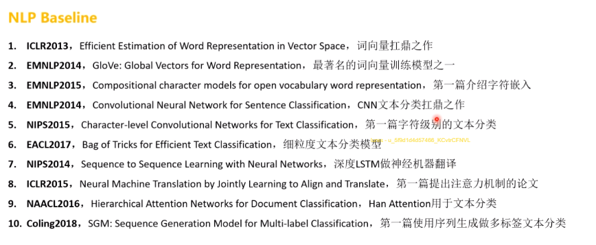
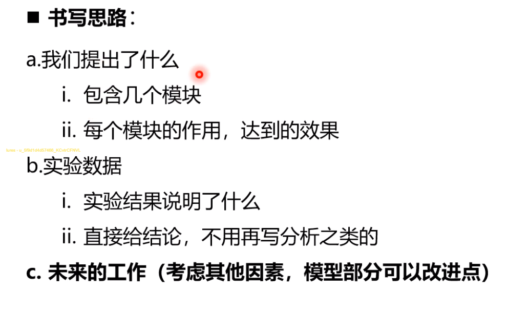

## 写作导论


#### 科研流程


有一些是针对`idea`的实验，说明`idea`的优越性


#### 文献管理


在`Chrome`浏览器上安装相应的`Zotero Connector`插件将看过的`pdf`保存到`Zotero`中，以后可以打开`pdf`看


#### 论文想法


`case study`看测试集结果和真实结果的区别，对`bad cases`提出自己的`idea`

方向可能是互相借鉴的，所以需要大量阅读文献


#### 写作绘图


官方一般会提供论文格式压缩包，只需要修改`.tex/.bib`文件

搜索应用`dblp`可以通过文章标题找到相应的`BibTex`格式，复制粘贴到`Overlef`即可


在`tex`正文部分后面加上`\cite{}`里面写上标题即可引用

正文中若要`table`可以在下面网站中`generate`


开始用会觉得麻烦，但是长期投稿建议使用这个工具


使用以上工具进行绘图，可以导出`pdf`然后截图，画图的配色以及内容需要注意


#### 回顾总结





## 投稿前的准备


#### 会议列表


通过网址`https://aideadlin.es/?sub=ML,CV,CG,NLP,RO,SP,DM,AP,KR,HCI`可以查看近期的`Deadline`


去要投稿的期刊官网去找他们的要求，如页数要求`page`、`latex`模板等


#### 时间规划

期刊(正刊)可以随时投，但是会议要在摘要截止时间前把摘要提交


自己给自己定好`deadline`


#### `Latex`模板


#### 投稿经验


看每年`track`均分情况


#### 回顾总结


## 论文写作理论课


#### 文章评定


写文章就是表达自己的观点，尽可能提供多的信息量，但是又不消耗读者过多能量的过程。


#### 论文书写

拿到文章后，会先看图和表(最直观的)，大部分审稿人是不会看附录的

一般实验部分占到`40%`左右，最少要`30%`，会让别人觉得你工作量比较大


不要完全叙述模型做了什么，要表现出模型的亮点


开头的不必要，摘要中尽量不要写太长的话。




语义上稍微变换点，尽量不要全抄


## 论文写作实践

```
FADO: Feedback-Aware Double COntrolling Network for Emotional Support Conversation

DCR-Net: A Deep Co-Interactive Relation Network for Joint Dialog Act Recognition and Sentiment Classification

Co-GAT: A Co-Interactive Graph Attention Network for Joint Dialog Act Recognition and Sentiment Classification
```

建议画成**双栏图**，写文章时多积累点好词好句

针对`bad case`的解释——去挑所有的模型共性问题去解释


## 投稿期间`responce`


## 投稿后的准备

